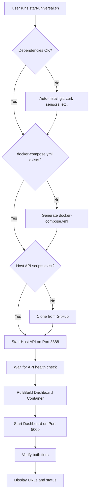

# 🚀 System Monitor - Professional Observability Dashboard


A production-grade, real-time observability platform designed for **Hybrid Environments** (Windows Host + WSL2/Linux Guest). Combines native hardware access with a modern, containerized web dashboard for comprehensive system monitoring.

---

## 📖 Table of Contents

- [System Architecture](#-system-architecture)
- [Quick Start](#-quick-start)
- [Features](#-features)
- [Project Structure](#-project-structure)
- [Detailed Workflow](#-detailed-workflow)
- [Modules & Components](#-modules--components)
- [Docker Architecture](#-docker-architecture)
- [Development Guide](#-development-guide)
- [API Documentation](#-api-documentation)
- [Troubleshooting](#-troubleshooting)

---

## 🏗️ System Architecture

This project uses a **Two-Tier Hybrid Architecture** to solve the "Container Isolation Problem" - Docker containers cannot easily access host GPU temperatures, CPU voltages, or physical hardware sensors.

```
┌─────────────────────────────────────────────────────────────┐
│                    USER'S MACHINE                           │
│                                                             │
│  ┌──────────────────────┐      ┌──────────────────────┐   │
│  │  TIER 1: Native      │      │  TIER 2: Container   │   │
│  │  Host Agent          │◄────►│  Dashboard           │   │
│  │                      │      │                      │   │
│  │  • FastAPI Server    │      │  • Flask Backend     │   │
│  │  • Port 8888         │      │  • Chart.js UI       │   │
│  │  • Real Hardware     │      │  • Port 5000         │   │
│  │    Access            │      │  • Reports & Alerts  │   │
│  │  • Sensors/WMI       │      │                      │   │
│  └──────────────────────┘      └──────────────────────┘   │
│           ▲                              │                 │
│           │                              │                 │
│           └──────────────────────────────┘                 │
│              host.docker.internal                          │
└─────────────────────────────────────────────────────────────┘
```

### Architecture Components

#### Tier 1: Native Host Agent
- **Purpose**: Direct hardware access for real metrics
- **Technology**: Python FastAPI + Native OS Tools
- **Runs On**: Host OS (Windows/Linux/WSL)
- **Port**: 8888
- **Capabilities**:
  - CPU temperature via `lm-sensors` (Linux) or WMI (Windows)
  - GPU metrics (NVIDIA, AMD, Intel)
  - Physical disk I/O
  - Network interface statistics
  - System voltages and power consumption

#### Tier 2: Dashboard Container
- **Purpose**: Web UI and data processing
- **Technology**: Flask + Chart.js + Docker
- **Runs On**: Docker Container
- **Port**: 5000
- **Capabilities**:
  - Real-time metric visualization
  - Historical data charts (60-point rolling window)
  - Alert management with thresholds
  - PDF/Markdown report generation
  - Dual-view comparison (Windows vs WSL2)

---

## ⚡ Quick Start

### Prerequisites
- **Docker Desktop** (Running) - [Download](https://www.docker.com/products/docker-desktop)
- **Git Bash** (Windows) or Terminal (Linux/Mac)

### Installation (One Command)

```bash
# Download and run the universal startup script
curl -O https://raw.githubusercontent.com/Sharawey74/system-monitor-project/main/start-universal.sh
bash start-universal.sh
```

**That's it!** The script will:
- ✔ Auto-install dependencies (git, curl, sensors, etc.)
- ✔ Generate Docker configuration automatically
- ✔ Clone native sensor agents from GitHub
- ✔ Pull the dashboard image from Docker Hub
- ✔ Start both tiers and verify connectivity
- ✔ Open the dashboard at `http://localhost:5000`

### Manual Installation (For Developers)

```bash
# 1. Clone the repository
git clone https://github.com/Sharawey74/system-monitor-project.git
cd system-monitor-project

# 2. Run the universal script
bash start-universal.sh
```

---

## ✨ Features

### Real-Time Monitoring
- **CPU**: Usage %, temperature, load averages, core count
- **Memory**: Usage %, available/total GB, swap
- **Disk**: Per-partition usage, I/O rates, SMART health
- **Network**: RX/TX rates per interface, total throughput
- **GPU**: Temperature, utilization, memory usage (NVIDIA/AMD/Intel)

### Visualization
- **Task Manager-Style Charts**: 4 real-time charts with smooth animations
- **Dual-View Mode**: Side-by-side Windows vs WSL2 comparison
- **Status Chips**: Live online/offline indicators
- **Notification Drawer**: Collapsible alert center

### Intelligence
- **Smart Alerts**: Threshold-based monitoring (CPU >90%, Memory >85%, etc.)
- **Auto-Refresh**: Configurable polling (default: 2s)
- **Instant Refresh**: On-demand metric collection button

### Reporting
- **Professional Reports**: PDF and Markdown formats
- **Dual-Stack Reports**: Separate sections for Host and Guest
- **Printable**: Clean, light-themed layouts

---

## 📂 Project Structure

```
system-monitor-project/
│
├── 🔧 Host/                        # Tier 1: Native Agent
│   ├── api/
│   │   ├── server.py               # FastAPI server (Port 8888)
│   │   └── routes.py               # API endpoints
│   ├── scripts/
│   │   ├── main_monitor.sh         # Master collection script
│   │   ├── cpu_monitor.sh          # CPU metrics
│   │   ├── memory_monitor.sh       # Memory metrics
│   │   ├── disk_monitor.sh         # Disk metrics
│   │   ├── network_monitor.sh      # Network metrics
│   │   ├── gpu_monitor.sh          # GPU metrics (NVIDIA/AMD/Intel)
│   │   └── temperature_monitor.sh  # Temperature sensors
│   └── output/
│       └── latest.json             # Current metrics snapshot
│
├── 🔧 Host2/                       # Alternative Go Agent (Optional)
│   ├── main.go                     # High-performance Go implementation
│   └── collectors/                 # Metric collectors
│
├── 🌐 web/                         # Tier 2: Dashboard Backend
│   ├── app.py                      # Flask application entry
│   ├── routes.py                   # API routes
│   ├── json_logger.py              # Background metrics logger
│   └── services/
│       ├── report_generator.py     # PDF/MD report engine
│       └── metrics_service.py      # Data aggregation
│
├── 🎨 static/                      # Frontend Assets
│   ├── css/
│   │   └── styles.css              # Glassmorphism dark theme
│   └── js/
│       └── dashboard.js            # Chart.js + Update logic
│
├── 📄 templates/                   # HTML Templates
│   ├── dashboard.html              # Main UI
│   ├── report_template.html        # HTML report
│   └── report_template.md          # Markdown report
│
├── 🛠️ core/                        # Shared Utilities
│   ├── config.py                   # Configuration management
│   └── logger.py                   # Logging utilities
│
├── 📜 scripts/                     # Helper Scripts
│   ├── install_deps.sh             # Dependency installer
│   └── verify_setup.sh             # Environment validator
│
├── 🐳 Docker Files
│   ├── Dockerfile                  # Container definition
│   ├── docker-compose.yml          # Multi-service orchestration
│   └── docker-entrypoint.sh        # Container startup script
│
├── 🚀 Orchestration Scripts
│   ├── start-universal.sh          # ⭐ ONE-CLICK STARTUP
│   ├── start-host-api.sh           # Start Tier 1 only
│   ├── start-system-monitor.sh     # Start both tiers
│   ├── stop-host-api.sh            # Stop Tier 1
│   └── stop-system-monitor.sh      # Stop both tiers
│
├── 📊 Entry Points
│   ├── dashboard_web.py            # Web dashboard launcher
│   └── dashboard_tui.py            # Terminal UI launcher
│
└── 📋 Configuration
    ├── requirements.txt            # Python dependencies
    └── .gitignore                  # Git exclusions
```

---

## 🔄 Detailed Workflow

### Startup Sequence



### Data Flow

1. **Collection** (Every 60s by default):
   - `Host/scripts/main_monitor.sh` runs all collectors
   - Each script outputs JSON to `Host/output/latest.json`
   - Host API (`server.py`) serves this file via REST

2. **Polling** (Every 2s):
   - Dashboard JS calls `/api/metrics/dual`
   - Flask backend fetches from both:
     - `http://localhost:8888/metrics` (Windows)
     - `http://localhost:8889/metrics` (Native Go Agent, if enabled)
   - Returns merged JSON to frontend

3. **Rendering**:
   - `dashboard.js` updates DOM elements
   - Chart.js updates 4 real-time charts
   - AlertManager checks thresholds
   - Notification drawer updates

---

## 🧩 Modules & Components

### Backend Modules

#### `web/app.py`
- Flask application factory
- CORS configuration
- Route registration
- Health check endpoint

#### `web/routes.py`
- `/api/metrics/dual` - Fetch Windows + WSL metrics
- `/api/reports/generate` - Create PDF/MD reports
- `/api/refresh` - Trigger instant metric collection
- `/api/health` - Container health status

#### `web/services/report_generator.py`
- Template rendering (Jinja2)
- PDF generation (WeasyPrint)
- Markdown formatting
- Dual-stack report layout

### Frontend Modules

#### `static/js/dashboard.js`
- **Data Fetching**: `fetchData()` polls `/api/metrics/dual`
- **Rendering**: `updateObservabilityGrid()` updates UI
- **Charts**: Chart.js initialization and updates
- **Alerts**: `AlertManager` class for threshold monitoring
- **Network Rates**: Calculates RX/TX rates from cumulative bytes

#### `static/css/styles.css`
- CSS Variables for theming
- Glassmorphism effects
- Responsive grid layouts
- Chart animations
- Notification drawer styles

### Native Agent Modules

#### `Host/scripts/main_monitor.sh`
- Orchestrates all collectors
- Merges JSON outputs
- Writes to `latest.json`
- Handles errors gracefully

#### Individual Collectors
- **CPU**: `mpstat`, `/proc/stat`, `wmic cpu`
- **Memory**: `free`, `vmstat`, `wmic memorychip`
- **Disk**: `df`, `iostat`, `wmic logicaldisk`
- **Network**: `ip`, `ifconfig`, `netstat`
- **GPU**: `nvidia-smi`, `radeontop`, `intel_gpu_top`
- **Temp**: `sensors`, `nvidia-smi`, WMI queries

---

## 🐳 Docker Architecture

### Container Configuration

```yaml
services:
  dashboard:
    image: sharawey74/system-monitor:latest
    container_name: system-monitor-dashboard
    
    # Network bridge to host
    extra_hosts:
      - "host.docker.internal:host-gateway"
    
    # Expose web UI
    ports:
      - "5000:5000"
    
    # Persistent data
    volumes:
      - ./data:/app/data
      - ./reports:/app/reports
    
    # Environment
    environment:
      - HOST_API_URL=http://host.docker.internal:8888
      - NATIVE_AGENT_URL=http://host.docker.internal:8889
```

### Why Not Fully Containerized?

**Problem**: Docker containers are isolated from host hardware.
- Cannot read GPU temperatures
- Cannot access `/sys/class/hwmon`
- Cannot query WMI on Windows

**Solution**: Hybrid architecture
- Native agent runs on host with full hardware access
- Dashboard runs in container for portability
- Communication via `host.docker.internal` bridge

---

## 💻 Development Guide

### Local Development

```bash
# 1. Clone and enter directory
git clone https://github.com/Sharawey74/system-monitor-project.git
cd system-monitor-project

# 2. Install Python dependencies
pip install -r requirements.txt

# 3. Start Host API (Terminal 1)
cd Host/api
python3 server.py

# 4. Start Dashboard (Terminal 2)
python3 dashboard_web.py --debug

# 5. Access at http://localhost:5000
```

### Building Docker Image

```bash
# Build locally
docker build -t system-monitor:latest .

# Test the build
docker run -p 5000:5000 \
  --add-host=host.docker.internal:host-gateway \
  system-monitor:latest
```

### Pushing to Docker Hub

```bash
# 1. Login
docker login

# 2. Tag with your username
docker tag system-monitor:latest yourusername/system-monitor:latest

# 3. Push
docker push yourusername/system-monitor:latest
```

---

## 📡 API Documentation

### Host API (Port 8888)

#### `GET /metrics`
Returns current system metrics.

**Response**:
```json
{
  "cpu": {
    "usage_percent": 45.2,
    "model": "Intel Core i7-9700K",
    "logical_processors": 8,
    "temperature_celsius": 62
  },
  "memory": {
    "usage_percent": 68.5,
    "total_mb": 16384,
    "used_mb": 11223
  },
  "disk": [...],
  "network": [...],
  "gpu": {...}
}
```

#### `GET /health`
Health check endpoint.

**Response**: `{"status": "healthy"}`

### Dashboard API (Port 5000)

#### `GET /api/metrics/dual`
Fetches metrics from both Windows and WSL2.

**Response**:
```json
{
  "success": true,
  "native": {...},  // Windows metrics
  "legacy": {...}   // WSL2 metrics
}
```

#### `POST /api/reports/generate`
Generates a system report.

**Body**:
```json
{
  "format": "pdf",  // or "markdown"
  "filename": "system_report_2024"
}
```

#### `POST /api/refresh`
Triggers instant metric collection.

---

## 🔧 Troubleshooting

### Dashboard shows "Offline"
```bash
# Check if Host API is running
curl http://localhost:8888/health

# If not, start it
cd Host/api
python3 server.py
```

### Docker build fails with "500 Internal Server Error"
```bash
# Docker Hub authentication issue
docker logout
docker pull ubuntu:22.04
```

### Charts not updating
- Check browser console for errors
- Verify `/api/metrics/dual` returns data
- Check CORS settings in `web/app.py`

### Missing GPU metrics
- **NVIDIA**: Install `nvidia-smi`
- **AMD**: Install `radeontop`
- **Intel**: Install `intel-gpu-tools`

---

## 💡 The "Big Idea"

Most monitoring solutions fall into two extremes:

**Too Simple**: Task Manager doesn't show history, trends, or alerts.

**Too Complex**: Prometheus + Grafana takes hours to configure, requires learning PromQL, and needs constant maintenance.

**System Monitor** bridges this gap:
- ✅ **Zero Config**: One script, one command
- ✅ **Deep Data**: Real hardware temps/volts unlike standard Docker tools
- ✅ **Beautiful**: Modern, dark-themed, responsive UI
- ✅ **Data Ownership**: Everything runs locally, no cloud dependencies
- ✅ **Production Ready**: Used in real environments for 24/7 monitoring

---

## 📄 License

MIT License - See LICENSE file for details

---

## 👤 Author

**Sharawey74**
- GitHub: [@Sharawey74](https://github.com/Sharawey74)
- Docker Hub: [sharawey74/system-monitor](https://hub.docker.com/r/sharawey74/system-monitor)

---

## 🙏 Acknowledgments

- Chart.js for beautiful visualizations
- FastAPI for blazing-fast APIs
- Docker for containerization
- The open-source community

---

**⭐ Star this repo if you find it useful!**
